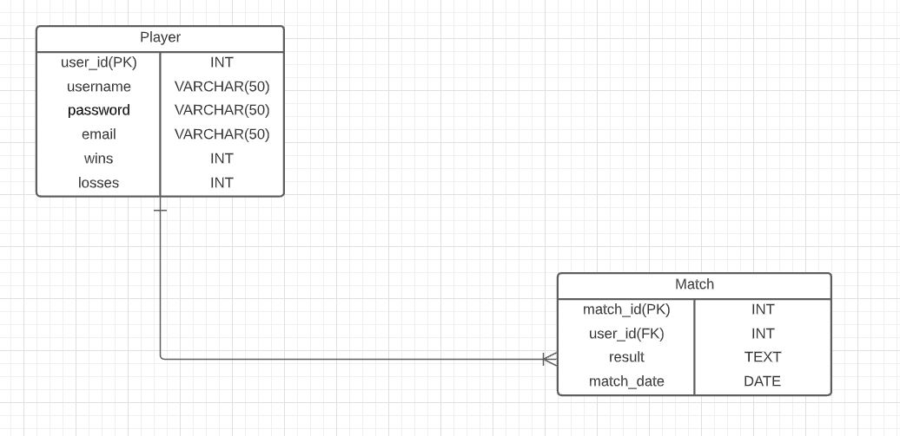
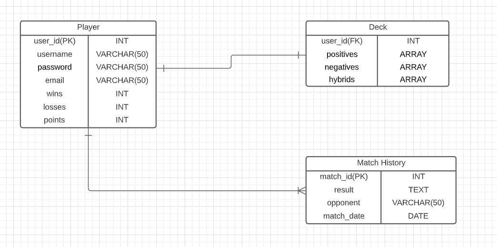

Project Description:

Pazaak - A card game from a game called Star Wars: Knights of the Old Republic. A popular card game that was played back in the Star Wars Old Republic era. The game is similar to blackjack but it has a twist where the player can manipulate their given number to achieve the winning number. The goal is to get closest to the number 20 or get exactly 20 without going over it. The player with the highest score less than or equal to 20 wins the round. Whoever wins three rounds within a match is the winner of the game.

## How I worked on this project

### Entity Relationship Diagram (ERD)

- User/Trainer table has a one to one-or-many relationship with the Match table, since the user can play one or more matches.

### User Stories

1. As a user, I can register.

| Acceptance Criteria                                                 |
|---------------------------------------------------------------------|
| Given - The user wants to create an account                         |
| When -  The user inputs their username, password, and email address |
| Then - An account with the information that user gave is created    |

2. As a user, I can log in.

| Acceptance Criteria                                                                                |
|----------------------------------------------------------------------------------------------------|
| Given - The user wants to log in to their account                                                  |
| When -  The user inputs the email address and password of their registered account                 |
| Then - When the account information is correct, the user is logged in and has access to the tables |

3. As a user, I can create matches.

| Acceptance Criteria                                                                          |
|----------------------------------------------------------------------------------------------|
| Given - The user wants to create a match with the results                                    |
| When -  The user sends a POST request to make a match with the results and date of the match |
| Then - The match is created and will be shown at the match history page                      |

4. As a user, I can view my match database

| Acceptance Criteria                                           |
|---------------------------------------------------------------|
| Given - The user wants to check their matches in the database |
| When -  The user sends a GET request to get all matches       |
| Then - All of the matches they have played in are returned    |

### System Tools

|            Tools             |
|:----------------------------:|
|         Spring Boot          |
|         Apache Maven         |
|           Postman            |
|         LucidCharts          |
| IntelliJ IDEA/Java 11 and 17 |
|       Json Web Tokens        |
|           Postgres           |
|            Google            |
|           Angular            |
|             HTML             |
|             CSS              |
|          Bootstrap           |
|          Typescript          |

## Endpoints

| ENDPOINT                         | FUNCTIONALITY        |
|----------------------------------|:---------------------|
| POST _/auth/users/register_      | Register a User      |
| POST _/auth/users/login_         | Log in as User       |
| GET _/auth/users/list_           | GET All Users        |
| GET _/auth/users/{username}_     | GET A User           |
| GET _/auth/users/user}_          | GET A User by JWT    |
| PUT _/auth/users/changepassword_ | UPDATE the password  |
| PUT _/auth/users/wins            | UPDATE user's wins   |
| PUT _/auth/users/losses_         | UPDATE user's losses |
| DELETE _/auth/users/delete_      | DELETE user account  |
| POST _/api/match/_               | CREATE A Match       |
| GET _/api/match/_                | GET All Matches      |
| GET _/api/match/{matchId}_       | GET A Match          |
| PUT _/api/match/{matchId}_       | UPDATE A Match       |
| DELETE _/api/match/{matchId}_    | DELETE A Match       |
| DELETE _/api/match/_             | DELETE ALL Matches   |

## If I had more time, I would change this

### Original Project Entity Relationship Diagram (ERD)

- Let user create their own deck.
- Let user gamble their points.
- Add hybrid cards where a user can choose to subtract or add the pazaak value.

## Project Challenges
1. Implementing the winning conditions for pazaak
- I spent a lot of time trying to get every winning condition right because I did not want the user to win or lose a game in an unfair way. I managed to get most of them I believe, but there might be some rare situations that cause the game to bug. I got a lot of them by just playing the game and seeing which conditions need to be fixed.

2. Connecting the backend to front end
- I researched for a while to learn how to do this because I have never made a full stack app before. I was able to thankfully get help from others,  and I found elaborate videos that explained how to make http requests with Angular.